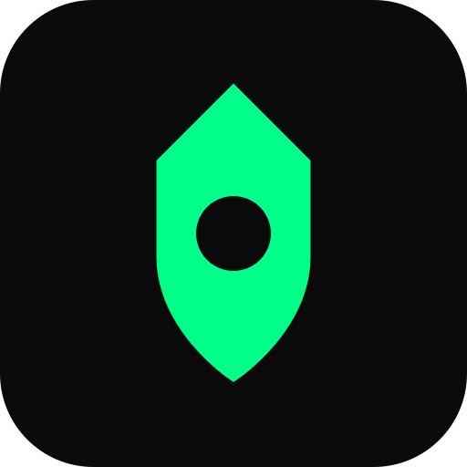

# Laucked

### Offensive security, by human experts

We break into web apps, APIs, mobile, infrastructure, and AI systems before attackers do. No resold scanner output. Every finding is manually discovered, exploited, and documented.

 

---

## What we test

| Domain | Focus |
| :-- | :-- |
| **Web applications** | Authentication, business logic, injection, broken access control |
| **APIs** | REST and GraphQL, BOLA, mass assignment, rate-limit abuse |
| **Mobile** | Android and iOS, local storage, transport security, hardening |
| **Infrastructure** | Network, Active Directory, privilege escalation, lateral movement |
| **AI and LLM systems** | Prompt injection, agent and tool abuse, OWASP LLM Top 10, EU AI Act readiness |

## AI and LLM security, as a core specialty

> LLMs and autonomous agents open an attack surface that classic pentesting does not cover. Prompt injection, tool poisoning, and agent privilege escalation are happening in production today.

This is where Laucked is different. We test AI systems the way a real attacker would, and we treat it as a primary discipline rather than a checkbox. If your product ships an LLM feature, an agent, or an MCP integration, that surface needs its own assessment.

## How we work

1. **Free diagnostic.** A surface-level review so you know where you stand, at no cost and no commitment.
2. **Expert pentest.** A scoped, manual engagement led by certified specialists, with a report your team can act on.
3. **Guard.** Continuous post-pentest monitoring so a clean report stays clean.

## Open source

This organization publishes methodology tooling built by our team to make offensive work faster and more reproducible. Original content only, no leaked course or exam material.

Browse the pinned repositories below.

## Team and certifications

Our specialists hold **OSCP** and **OSEP** certifications, with a continued investment in the OffSec stack and AI security research.

---

### Think your attack surface is covered? Let us check.

**[laucked.com](https://laucked.com)** &middot; Based in the Toulouse area, France &middot; Serving France, Belgium, and beyond

